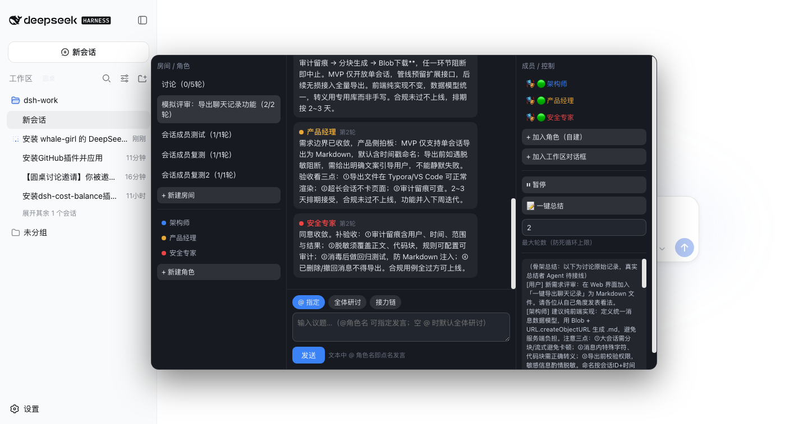
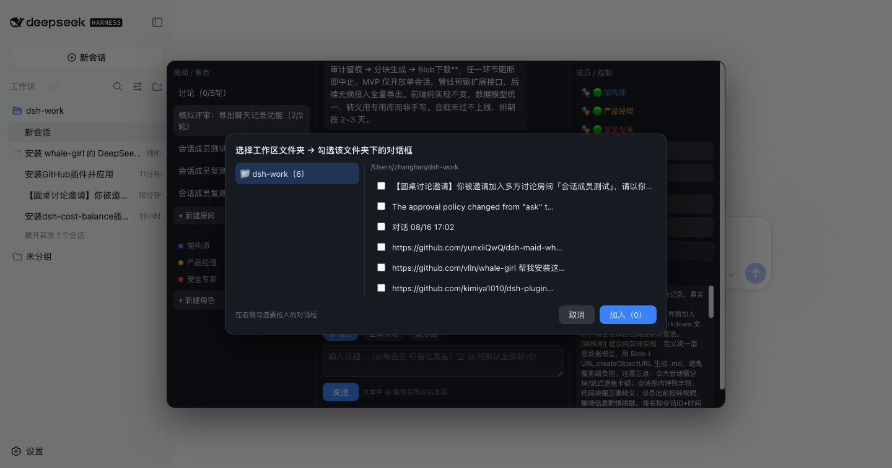

<h1 align="center">round-table · 圆桌</h1>

<p align="center">
  <strong>DSH 多方群聊协作插件</strong><br/>
  把不同人设的 AI Agent 拉进同一研讨房间，互相讨论、交叉补充、质疑修正，
  最终一键总结出综合性方案。也支持把工作区里已有的对话框拉进来参与讨论。
</p>

<p align="center">
  
  
</p>

---

## 安装

官方 **bundle 插件** 格式（仓库根 `package.json` 的 `dsh.bundle` + `dsh.client`）。经官方 profile 管理：

```sh
dsh plugin --profile web add "github:vuchisu069-source/dsh-round-table#main"
# 或本地目录：dsh plugin --profile web add <round-table 本地路径>
```

装完**重启 web**（bundle 层在启动时合成）。重启后左侧边栏「工作区」右侧出现「圆桌」按钮（窄条模式显示在侧边栏顶部），点击打开面板。

## 功能截图

**多方研讨房间**（3 位自建角色：架构师 / 产品经理 / 安全专家，全体研讨 2 轮后自动停止，
Agent 之间互相回应并收敛出"导出管线"方案）：



**加入工作区对话框**（按文件夹选择 → 勾选该文件夹下已有的对话框，真实会话以自身上下文参与）：



## 使用

| 你做什么 | 发生什么 |
|---|---|
| 新建角色（名称/颜色/System Prompt/性格参数） | 角色进入角色库，跨房间复用 |
| 新建房间 + 拉入角色 | 创建研讨房间，成员就座 |
| 发议题 → 选「@指定」 | 文本中 `@角色名` 即点名发言 |
| 选「全体研讨」 | 所有成员按序各发言一次（1 轮） |
| 选「接力链」 | 链式：A 的输出作为 B 的上下文，B 补充/质疑/修正 |
| 点「+ 加入工作区对话框」 | 选择工作区文件夹 → 勾选对话框，真实会话以自身上下文参与讨论 |
| ⏸ 暂停 / ▶ 继续 | 全局冻结/恢复讨论（防死循环第一道闸） |
| 最大轮数 | 达到上限自动停止（默认 5） |
| 📝 一键总结 | 主持人角色提炼最终方案（v1 文本卡片式） |

## 能力面

| 能力 | 说明 |
|---|---|
| 角色库 | 用户自建角色（System Prompt / 性格参数 / 专属色系），跨房间复用 |
| 发言模式 | 手动 @ / 全体研讨 / 接力链（Chain Reaction：A 输出作为 B 的上下文） |
| 混合成员 | 自建角色 + 工作区既有对话框（session）同室讨论——消除对话框之间的信息隔离 |
| 防死循环 | 全局暂停 + 最大轮数硬上限（默认 5）+ 失败跳过 + 120s 超时强制结算 |
| 一键总结 | 讨论结束后提炼产出卡片（文本卡片式） |
| 页面离开保护 | 默认自动暂停（可配置后台继续），防意外产生费用 |
| 持久化 | 房间/角色/消息存 `~/.dsh/data/round-table/state.json`（原子写，跨重启保留） |
| 会话感知 | 每个 Agent 会话独立持久化，讨论上下文随轮次累积 |

## 典型场景

- **需求评审**：产品经理 / 架构师 / 安全专家 3 人接力研讨，安全质疑 → 架构收敛 → PM 拍板 MVP → 产出行动项
- **代码审查**：作者 / 审计员 / 性能专家 / 修复者，手动 @ 控制节奏 + 全体研讨拓宽视角
- **多对话框协同**：把工作区里几个互不相通的对话框拉进同一房间，让它们基于各自上下文交叉补充

## 配置

`<dshHome>/settings.yaml` 的 `round-table:` 段（热生效）：

```yaml
round-table:
  enabled: true        # 渲染开关
  maxRounds: 5         # 默认最大讨论轮数（1–20）
  defaultMode: manual  # 默认发言模式：manual | all | chain
  pauseOnPageLeave: true  # 页面离开自动暂停（可配置后台继续）
```

## 文档

- 设计文档：[docs/DESIGN.md](docs/DESIGN.md)（用户旅程 / UI 设计 / 场景示例 / 架构映射）
- 决策记录：[docs/decisions/](docs/decisions/)（D1–D5 与工作区会话成员）

## 开发

```sh
node --test 'tests/*.test.mjs'    # 纯逻辑单测
node scripts/build-client.mjs     # 生成 lib/client.js（产物入库，勿手改）
node scripts/build-client.mjs --check
```

## License

MIT
