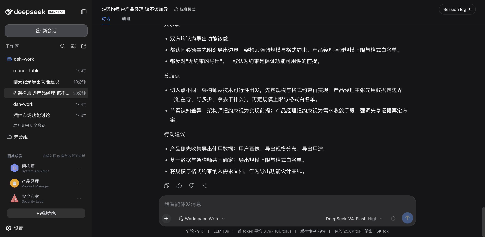
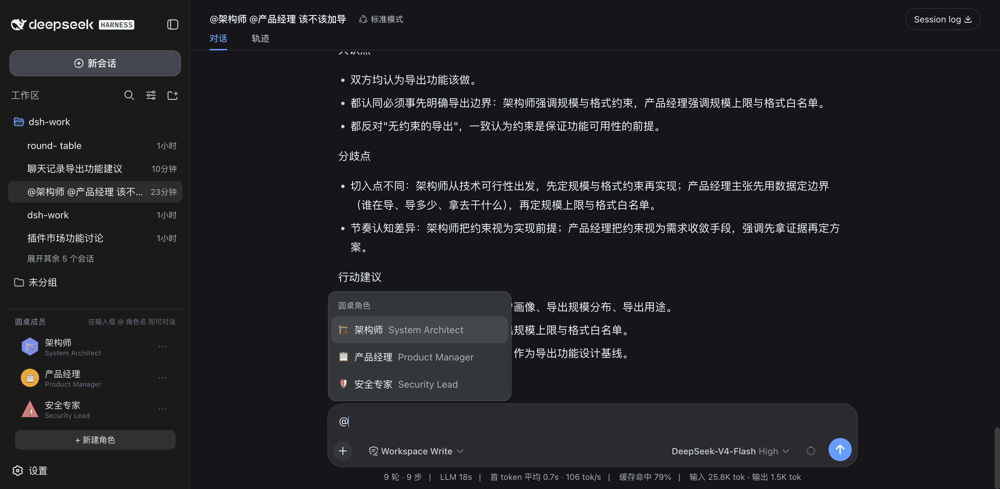
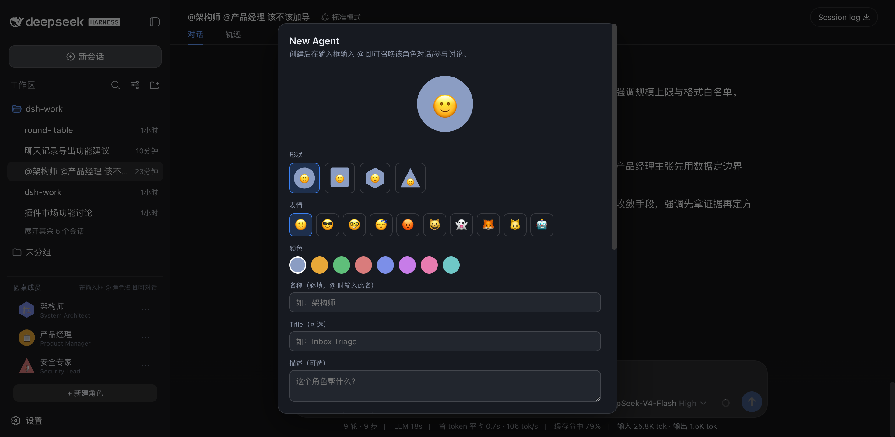
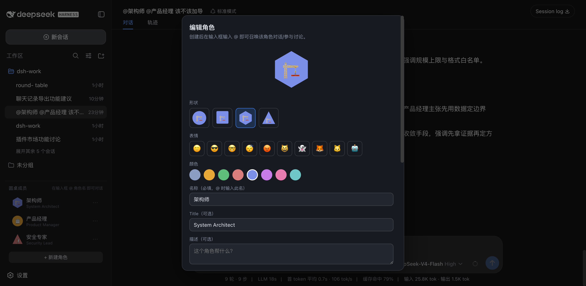

<h1 align="center">round-table · 圆桌</h1>

<p align="center">
  <strong>DSH 角色扮演与多角色讨论插件（@ 提及范式）</strong><br/>
  在 DSH 左侧边栏创建带形象的 AI 角色，然后在对话输入框 <code>@角色名</code> 直接召唤：<br/>
  单角色 = 该角色以独立人格回答；多角色 = 各角色以<b>独立会话</b>真实讨论一轮，最后主持人收敛出
  共识 / 分歧 / 行动建议。
</p>

<p align="center">
  
  
  
</p>

---

## 目录

- [这是什么](#这是什么)
- [安装](#安装)
- [功能截图](#功能截图)
- [快速上手](#快速上手)
- [能力面](#能力面)
- [工作机制](#工作机制)
- [典型场景](#典型场景)
- [配置](#配置)
- [开发](#开发)
- [License](#license)

---

## 这是什么

**round-table** 是 DSH（DeepSeek Harness）的官方 bundle 格式插件，把「AI 角色」引入你的日常对话：

1. **创建角色**：左侧边栏常驻「圆桌成员」——你可以创建任意数量的 AI 角色，每个角色有独立的
   **形象**（4 种形状 × 10 种表情 × 8 种配色）、**System Prompt**、**性格参数**、以及可选的
   **SOUL.md 人设文档**（Hermes 范式）。
2. **@ 召唤**：在 DSH 主输入框输入 `@`，弹出角色候选（带形象图标）；选中即插入 `@角色名`，
   发送后模型完全以该角色的身份、第一人称回答。
3. **真·多角色讨论**：`@架构师 @产品经理 讨论xxx` —— 不再是"一个模型分饰两角"，
   而是每个角色以**独立的 Agent 会话**真实推理（架构师先发言，产品经理拿到架构师的
   **真实输出**后独立回应），最后主持人收敛出**共识点 / 分歧点 / 行动建议**。
4. **工具能力**：角色 @ 时**可以使用 DSH 宿主自带的全部工具**（读文件、搜索、执行命令等）——
   让"架构师"真的去读你项目的代码再给方案。

> 相比传统"房间 / 多方群聊"形态，@ 范式把角色直接织入日常对话流：
> 不用切面板、不用进房间，想到谁就 @ 谁，成本更低、更自然。

---

## 安装

官方 **bundle 插件** 格式（仓库根 `package.json` 的 `dsh.bundle` + `dsh.client`）。经官方 profile 管理：

```sh
dsh plugin --profile web add "github:vuchisu069-source/dsh-round-table#main"
# 或本地目录：dsh plugin --profile web add <round-table 本地路径>
```

装完**重启 web**（bundle 层在启动时合成）。重启后左侧边栏底部出现「圆桌成员」区块。

---

## 功能截图

**多角色讨论结果**：`@架构师 @产品经理 一句话：导出功能该不该做？`
主会话快速确认 → 架构师、产品经理**各自独立发言**（互不知晓对方内容，真实推理）→
主持人收敛出结构化结论（共识 / 分歧 / 行动建议）：



**@ 候选**：主输入框输入 `@` 弹出角色候选（emoji 形象 + 名称 + 人设摘要），选中即插入 `@角色名`：



**New Agent 模态**：形象（形状/表情/颜色）+ 名称 / Title / 描述 / System Prompt / 性格参数 /
**Advanced 折叠区**（SOUL.md 人设文档——留空则自动从名称/描述合成，@ 时注入）：



**编辑角色**：角色卡片 ⋯ 打开编辑模态——保留原 id 更新，底部带**删除**按钮（确认后删除）与 SOUL 编辑：



---

## 快速上手

| 你做什么 | 发生什么 |
|---|---|
| 左栏「+ 新建角色」 | 打开 New Agent 模态：选形象（形状/表情/颜色）+ 填名称/Title/描述/System Prompt/性格 + Advanced（SOUL.md） |
| 左栏点角色卡片 | 自动把 `@角色名 ` 插入主输入框（便捷召唤） |
| 左栏角色卡片 ⋯ | 编辑角色（含 SOUL、删除） |
| 输入框输入 `@` | 弹出角色候选（官方输入管线），选中插入 `@角色名 ` |
| 发 `@架构师 帮我看看` | 主会话**以架构师身份**回答；可调用 DSH 自带工具（读文件/搜索/执行命令） |
| 发 `@架构师 @产品经理 讨论xxx` | **真·多角色讨论**：各角色独立会话各答一轮 → 主持人收敛出共识/分歧/行动建议 |
| @ 角色不回复？ | 检查角色名称是否与候选一致（@ 按名称精确匹配）；讨论有 90s/角色 与 120s 整体超时保护 |

### 单角色 @ 示例

```
你：@架构师 看看这个项目的 lib/src 结构，评估一下分层是否合理
架构师：读了 lib/src 后，我的评估是……（角色卡 + SOUL + 工具读码）
```

### 多角色讨论示例（一次调用的完整链路）

```
你：@架构师 @产品经理 一句话：导出功能该不该做？
主会话：已收到，各角色独立讨论进行中，结果稍后汇总。
架构师（独立会话）：该做，但前提是明确导出规模与格式约束……
产品经理（独立会话）：该做，但先别谈架构，先用数据定边界：谁在导、导多少、拿去干什么……
主持人：共识点 3 条 / 分歧点 2 条 / 行动建议 3 条（结构化收敛）
```

> 多角色讨论中，各角色是**串行接力**：A 的**真实输出**作为 B 的上下文，B 独立推理后再回应——
> 观点的分岔与交锋是真实的，不是同一个模型"编两段"。

---

## 能力面

| 能力 | 说明 |
|---|---|
| 角色库 | 用户自建角色（形象 / System Prompt / 性格 / SOUL），跨会话复用，持久化到 `~/.dsh/data/round-table/state.json` |
| 形象系统 | 4 形状 × 10 表情 × 8 配色，左栏卡片、@ 候选、New Agent 模态统一使用 |
| SOUL.md | 角色人设文档（Hermes 范式）：@ 时注入角色卡，**2000 字上限截断**防长文档烧 token；留空自动合成 |
| @ 提及 | 官方输入触发管线（`ctx.inputTriggers`）：输入 `@` 弹候选，选中插入 `@角色名`，点击角色卡片也可插入 |
| 单角色扮演 | 主会话以该角色身份回答（第一人称、不再以通用助手身份） |
| 真·多角色讨论 | 各角色**独立 Agent 会话**串行接力（A 输出 → B 上下文），**仅一轮**防死循环；主持人收敛共识/分歧/行动 |
| 工具能力 | 角色 @ 时可使用 DSH 宿主全部工具（读文件/搜索/执行命令）——角色能真读代码再回答 |
| 纯文本护栏（多角色协调阶段） | 多角色讨论时主会话等待阶段**禁用工具**（防 Deep diving 烧 token）；角色独立会话与单角色不受限 |
| 成本控制 | 讨论 90s/角色 + 120s 整体超时；SOUL 截断；协调等待阶段无工具 |
| 持久化 | 角色存 `~/.dsh/data/round-table/state.json`（原子写，跨重启保留）；角色独立会话由 DSH 持久化 |

---

## 工作机制

### 架构总览

```
┌─────────────────────── 浏览器（client half）───────────────────────┐
│ 左栏「圆桌成员」section    │   @ 输入触发管线（官方 ctx.inputTriggers） │
│  ├ 角色卡片（avatar/⋯）    │   └ 注册 @ source：「圆桌角色」          │
│  ├ + 新建角色（模态）       │      candidates() → 角色候选（实时拉取） │
│  └ 点击卡片 → 插入 @角色名  │      onPick() → 插入字面 @角色名         │
└───────────────────────────────────────────────────────────────────┘
                              │  /round-table/state（轮询 + SSE 同步）
                              ▼
┌─────────────────────── 宿主（Node half，index.mjs）────────────────┐
│ 角色账本（state.json）                                             │
│ session/event：检测主会话 user/message 中的 @角色名                 │
│  ├ 单角色 → system-prompt/assemble 注入扮演指令（+工具放开）        │
│  └ 多角色 → ① assemble 注入协调等待（tools 清空，防 Deep diving）    │
│            ② 驱动角色独立会话（resume/create + followup，串行接力） │
│            ③ 全部回复后 followup 主会话 → 主持人收敛                │
└───────────────────────────────────────────────────────────────────┘
```

### 关键机制（官方 API）

| 机制 | 说明 |
|---|---|
| `ctx.inputTriggers.registerSource` | 浏览器端向官方 @ 管线注册「圆桌角色」候选源（trigger: `@`） |
| `system-prompt/assemble` waterfall | `AssembleContext.scope` 即 agent；据此向主会话注入角色卡（单角色）或协调等待指令（多角色）；多角色时**清空 `assembly.tools`** |
| `ctx.agents.resume / create` | 角色独立会话：已持久化会话走 `resume`（实测 `create` 对已存在 sessionId 会空转），全新会话才 `create` |
| `session/event` | 检测主会话 user/message（多角色 @ → 启动讨论）；`turn/end` 回读角色发言 |
| `agent.followup` | 驱动角色会话发言 + 讨论完成后触发主会话主持人收敛 |
| `eventUserText` | 从 user/message 事件提取文本（比 assemble 时读 session.events 可靠——后者会拿到 "Current runtime context" 快照） |
| `parseMentions` | `@角色名` 解析（lookbehind 排除邮箱/URL 里的 `@`；去重；上限 4 个角色） |

### 为什么是真讨论

多角色讨论 = **串行接力**：角色 A 的独立会话先收到「议题 + 角色卡」，独立推理后回复；
round-table 捕获 A 的**真实输出**，作为「前序发言」连同 B 的角色卡发给 B 的独立会话；
B 独立推理后回应。**每个角色一次调用、各自独立上下文**，观点真实分岔——
主持人最后收敛出的"分歧点"是讨论中真实出现的，而不是编排出来的。

### 成本设计

- **纯文本护栏**：多角色讨论的**主会话等待阶段**清空工具（模型无法 Deep diving）；
  角色独立会话与单角色 @ **放开工具**（用户决策：角色应能读代码干活）。
- **SOUL 截断**：2000 字符硬上限。
- **超时保护**：单角色发言 90s、整体讨论 120s，超时自动推进/结束。
- **仅一轮**：每个角色只发言一次（A → B → 结束），从机制上杜绝死循环。

---

## 典型场景

- **需求评审**：`@产品经理 @架构师 @安全专家 讨论新功能的需求边界`——
  产品经理讲用户价值、架构师讲技术约束、安全专家质疑合规风险，主持人收敛出行动项。
- **代码审查**：`@架构师 评估一下 lib/src 的分层`——架构师用 DSH 工具**真读代码**后给意见。
- **方案打磨**：`@架构师 @产品经理 一句话各自的方案倾向`——快速两轮对比，主持人提炼分歧点。
- **日常扮演**：`@安全专家 这段话有没有泄露隐私的风险`——让专业角色随时在场。

---

## 配置

`<dshHome>/settings.yaml` 的 `round-table:` 段（热生效）：

```yaml
round-table:
  enabled: true        # 渲染开关
  maxRounds: 5         # 默认最大讨论轮数（1–20）
  defaultMode: manual  # 默认发言模式：manual | all | chain
  pauseOnPageLeave: true  # 页面离开自动暂停（可配置后台继续）
```

> 注：`maxRounds / defaultMode / pauseOnPageLeave` 为 v1（房间范式）遗留配置，v2 @ 范式下
> 讨论**固定一轮**（机制上防死循环）；配置项保留以兼容旧数据。

---

## 开发

```sh
node --test 'tests/*.test.mjs'    # 纯逻辑单测（state / mentions）
node scripts/build-client.mjs     # 生成 lib/client.js（产物入库，勿手改）
node scripts/build-client.mjs --check
```

源码结构：

```
index.mjs                    # Node half：角色账本 + 讨论编排 + 路由
lib/client/index.mjs         # 浏览器 half：左栏角色库 + @ source 注册
lib/client.js                # 构建产物（勿手改）
lib/src/state.mjs            # 角色数据模型（形象/SOUL/迁移）
lib/src/mentions.mjs         # @ 解析 + 扮演/讨论 prompt 组装（纯函数）
lib/src/config.mjs           # 配置命名空间与校验
lib/src/persistence.mjs      # state.json 原子持久化
tests/                       # state.test.mjs / mentions.test.mjs
docs/decisions/              # 决策记录（D1–D6 与 v2 范式决策）
```

---

## License

MIT
